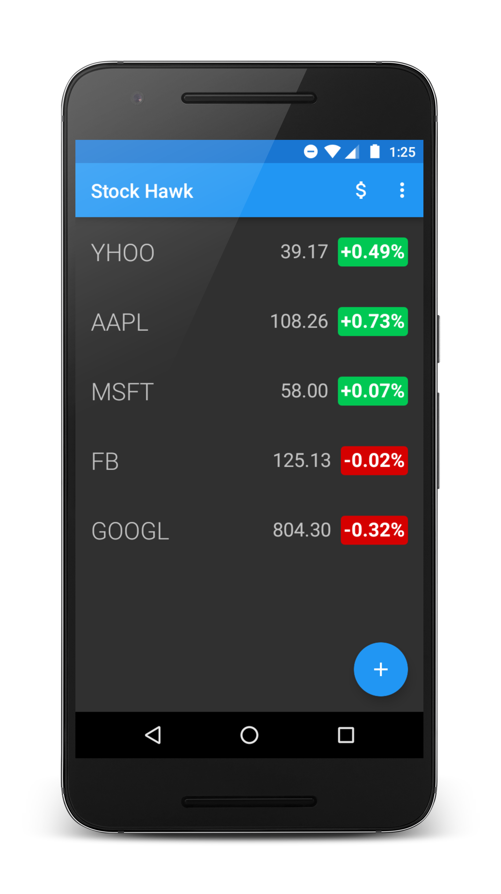
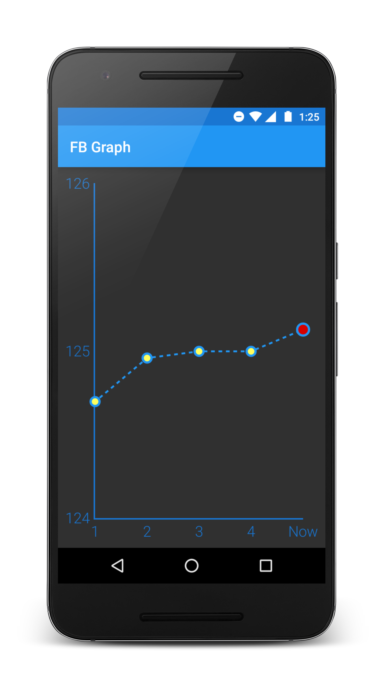

# StockHawk
An Android application that keeps track of the ups and downs of your favourite stocks and also provides you with a graph representation of the stock values over time. This is part of the android nanodegree program. 

## Features
The features added as a part of the project:
* Visualisation of the stock's value over time through graph.
* Widget to add to the app experience.
* Accessible to sight-impaired users.
* Localized for distribution in other countries.
* Offline data persistence.

##Screenshots

## License
The content of this repository is licensed under [MIT LICENSE](LICENSE.MD).
